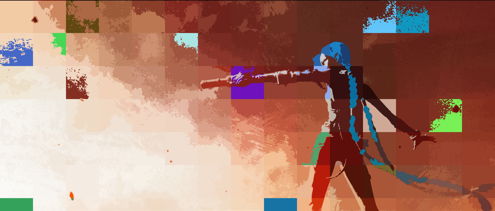
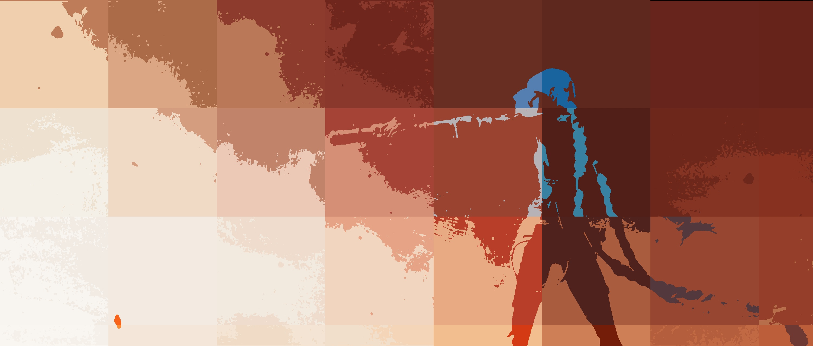
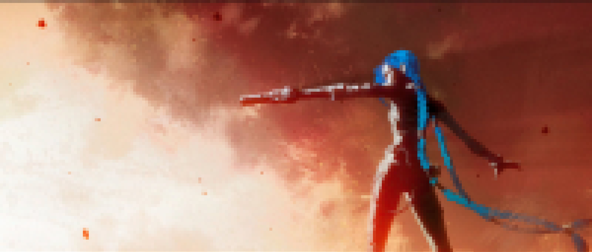
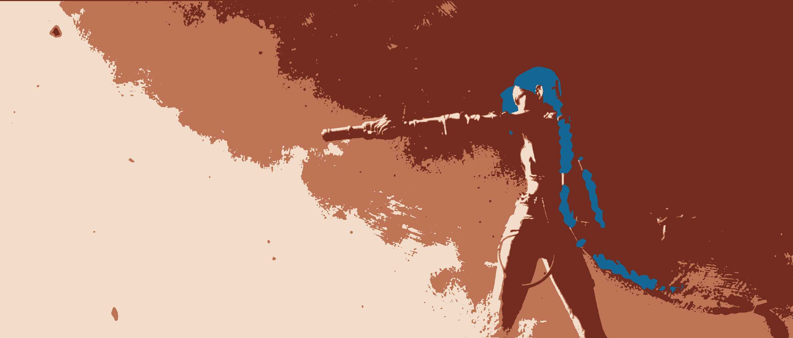

# Image-Recolour-and-Pixelation
Python notebook for applying pixelation and recolouring on image subsections.

For each of the images in the Example-Images directory, this document briefly explains how the results were achieved.

Note: all three results can be produced by modifying a small set of variables - making this a powerful tool for quickly getting a variety of new images.

---

arcane.jpg -- Original Image

---

pixel.jpg - Random Recolouring of Subsections

This image makes use of the random colour injection process - by which up to a certain percentage of subsections of the image is recoloured such that a random colour replaces one of the colours in the palette. Currently, only three colours can be selected in the palette (num_colours = 3), meaning one of those colours will randomly be replaced. The purple subsection in the middle of the image shows the most commonly occuring colour being replaced, while the green subsection encompassing her leg shows the same for a less commonly occuring colour.

Set the following:

use_random = True

tolerance = 30

section_size = 200

threshold = 0.2

num_colours = 3

---

pixel-2.jpg - Simple Recolouring

This image differs from the previous image by turning off the randomization element, increasing the subsection size, and decreasing the number of colours used

Set the following:

use_random = False

tolerance = 30

section_size = 400

threshold = 0.2

num_colours = 2
---

pixel-3.jpg - Pixelation (Small scale recolouring)

This image is similar to the previous image, except the number of colours is further decreased, and the subsection size is set to be very small. In doing so, the colours across a subsection are all set to be the same, effectively blurring the image.

Set the following:

use_random = False

tolerance = 30

section_size = 15

threshold = 0.2

num_colours = 1
---

pixel-4.jpg - No Pixelation Recolour

This image takes the opposite approach - by setting the subsection size to be equal to or greater than the size of the input image (ie. or at least the longest side of the input image since subsections are by definition square), then the image is simply recoloured as a whole.

Set the following:

use_random = False

tolerance = 30

section_size = 3000

threshold = 0.2

num_colours = 4
